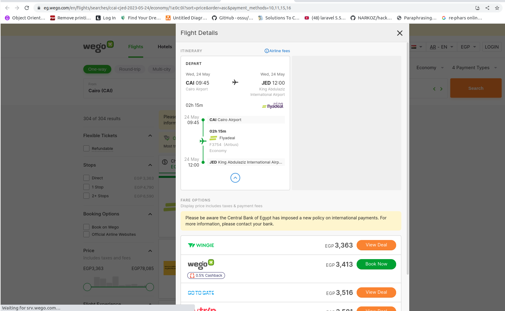

## Data engineering 
### scraping [wego fliths](https://eg.wego.com/en/flights/searches/cCAI-cJED-2024-04-01/economy/1a:0c:0i?sort=price&order=asc&payment_methods=10,11,15,16) website and store data in mongo db

### technologies
python, fastapi,monogo, motor,selenuim, celery

### notes 
- fastapi :for easy exute scrpe task from website
- mongo :to store scraping data and retrive it also using fast api
- motor :to connect mongo to python 
- celery : to do scrap task in bakgroung and schedule time to scrape in 
- selenuim  : because wego is complicated website because it use shadow DOM to hide DOM content and need a lot of clicks  😅 to change views whiles scraping 
 
### sample images
 
 
 
